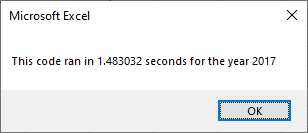
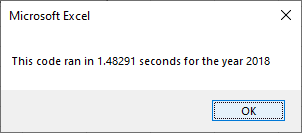
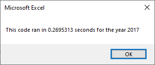
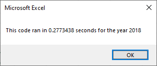

# Challenge 2 - Stock Analysis Refactored Code

## Project Overview

The purpose of this project was to take a spreadsheet that was originally created to analyze a small subset of stock data and modify it to be able to run for a much larger set of data, and be able to do so as efficiently as possible.

To do this I had to refactor the original code so that all analysis could be performed looping through the dataset one time, rather than the original process of looping through the dataset several times, once for each stock we were trying to analyze.  

## Analysis and Challenges

### Analysis on Original Code
The process the original code took was to evaluate each stock ticker one at a time.  For each ticker (indexed by the variable i), the entire dataset was read, calculating the values for total volume, starting price, and ending price for the current stock ticker.  Once the entire dataset was read, the output values for that ticker were written to our report, and the process was repeated with the next ticker ("next i").  

'4) Loop through tickers
    For i = 0 To 11
       ticker = tickers(i)
       totalVolume = 0
       
       '5) loop through rows in the data
       Worksheets("2018").Activate
       For j = 2 To RowCount
               
            '5a) Get total volume for current ticker
            If Cells(j, 1).Value = ticker Then
                totalVolume = totalVolume + Cells(j, 8).Value
            End If
            
            '5b) get starting price for current ticker
            If Cells(j, 1).Value = ticker And Cells(j - 1, 1).Value <> ticker Then
                'Set starting price
                startingPrice = Cells(j, 6).Value
            End If
        
           '5c) get ending price for current ticker
            If Cells(j, 1).Value = ticker And Cells(j + 1, 1).Value <> ticker Then
                'Set ending price
                endingPrice = Cells(j, 6).Value
            End If
        Next j
        
        '6) Output data for current ticker
        Worksheets("All Stocks Analysis").Activate
        Cells(4 + i, 1).Value = ticker
        Cells(4 + i, 2).Value = totalVolume
        Cells(4 + i, 3).Value = endingPrice / startingPrice - 1
        
   Next i

Following are the results of running the original code on both the 2017 and 2018 stock data:

### Analysis of Refactored Code
Refactoring the code, two main changes were made in order to increase performance.  The first was to create 3 output arrays to hold the values of total volume, starting price, and ending price for each ticker.  These values would be accumulated here to be written to our report all at once after the entire dataset has been processed.  The second edit was to have one loop only to read the entire dataset.  Within that loop, the ticker is determined as each line is read in order to calculate, store, and eventually report the values we wish to analyze.

For i = 2 To RowCount
    
        '3a) Increase volume for current ticker
        tickerVolumes(tickerIndex) = tickerVolumes(tickerIndex) + Cells(i, 8).Value
           
        '3b) Check if the current row is the first row with the selected tickerIndex.
        If Cells(i, 1).Value = tickers(tickerIndex) And Cells(i - 1, 1).Value <> tickers(tickerIndex) Then
            tickerStartingPrices(tickerIndex) = Cells(i, 6).Value
              
        End If
        
        '3c) check if the current row is the last row with the selected ticker
        If Cells(i, 1) = tickers(tickerIndex) And Cells(i + 1, 1) <> tickers(tickerIndex) Then
            tickerEndingPrices(tickerIndex) = Cells(i, 6).Value
            '3d Increase the tickerIndex.
            tickerIndex = tickerIndex + 1
            
        End If
    
    Next i

Following are the results of running the refactored code on both the 2017 and 2018 stock data:

### Potential Challenges

One challenge is that this process is very dependent on sort order of the datset.  In order for the results to be reported as expected, the dataset to be analyzed must be sorted by both stock type and date within each stock type.  

Another challenge could be the addition of new stocks that are not included in the current dataset.  The current input array of stock tickers is a set size of 11 and contains specific stocks.  A future enhancement that could be evaluated would be whether or not this code could be updated to be able to read a dataset of any number of stocks or different stocks.  This would be beyond the scope of refactoring, but additional functionality that could be considered.

## Results/Summary

- In general, I think there are several advantages to refactoring code.  Modifying code that already exists saves time over starting from scratch.  You can change only those pieces that need to be changed to add efficiencies, improve performance, or even improve readability.   Disadvantages to refactoring, could be introducing unexpected issues into code that already works (even if not as efficiently as it could).  Care would need to be taken to test throughly so that everything still functions correctly and as expected. 

- In this particular project, refactoring the code was definitely advantageous.  Changing the process of navigating through the stock data did allow it to run significantly faster.  While running for a smaller dataset may not see as much of an improvement, the difference will be even more noticable the larger the dataset becomes.  Because this program was not very long or complicated, it was easier to ensure the correct results were still being produced after being refactored.
